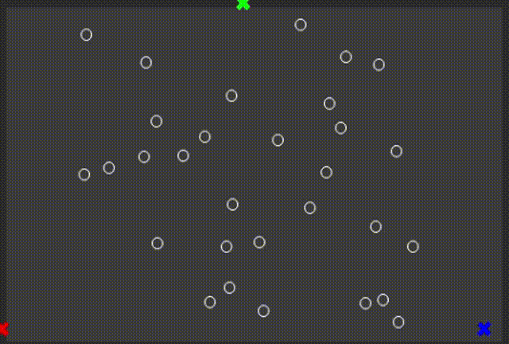
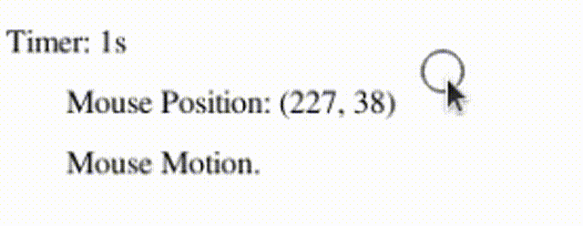
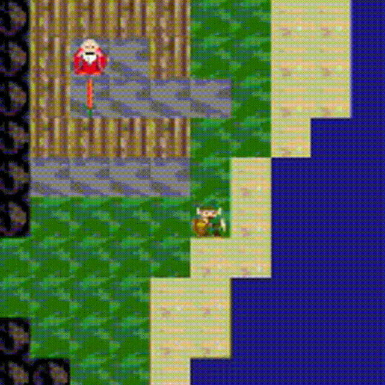

# Idris2GL
A Graphics Library for Idris2, based on SDL2.

- Provides painless functions to build 2D vector graphics, animations and simulations.
- Also provides `SDL2` , `SDL2_image` , `SDL2_gfx`,  `SDL2_ttf` bindings.
- Supports most of keyboard events.
- Supports mouse events.
- Supports other events. (In Progress)
- 2D Shapes, text. 
- Animations.
- Simulations.
- Play games.
- Frames per second control.

## Build

1. Navigate to `src`.
2. `$ idris2 --build idrisGL.ipkg` builds the libraries.
3. `$ idris2 --install idrisGL.ipkg` installs the packages into Idris2 prefix.
4. `$ idris2 --clean idrisGL.ipkg` cleans everything.

## Dependencies

- SDL2
- SDL2 Image
- SDL2 GFX
- SDL2 TTF

## Samples

`$ idris2 -p idrisGL IdrisGL.idr` to load dependencies.

### Display - BMP file or showing pictures in other formats.

- `samples/display_showBMP/ShowBMP.idr`
- `samples/display_showIMG/ShowIMG.idr`
- Or use SDL2 binding functions.

```
display : Display -> Color -> Picture -> IO ()
```


### SDL bindings example - Handling Key Presses Events

- `samples/keyPresses/KeyPresses.idr`
- Press [ Up | Down | LEFT | RIGHT ] buttons to switch between pics.
- Another example of using bindings.


### Display - Draw shapes

- `sample/display_drawShapes/DrawShapes.idr`

```
display : Display -> Color -> Picture -> IO ()
```


### Display - Text

- `sample/display_text/Text.idr`

```
display : Display -> Color -> Picture -> IO ()
```


### Animation - Clock

- `sample/animate_clock/Clock.idr`

```
animate : Display 
       -> Color 
       -> Double
       -> (Double -> Picture)
       -> IO ()
```


### Simulation - K-means clustering

- `sample/simulation_kmeans/Kmeans.idr`

```
simulate : Display 
        -> Color 
        -> Double
        -> model
        -> (model  -> Picture)
        -> (Double -> model -> model)
        -> IO ()
```



### Play - Mouse Event

- `sample/play_mouseEvents/Mouse.idr`
- Mouse motion.
- Mouse buttons (down/up).
- Mouse wheel.

```
play : Display 
    -> Color
    -> Double
    -> world
    -> (world   -> Picture)
    -> (Eve     -> world -> world)
    -> (Double  -> world -> world)
    -> IO ()
```



### Play - A Simple RPG

- `sample/play_game/Game.idr`
- A very simple 2D RPG.
- W: Go up | S: Go down | A: Go left | D: Go right

```
play : Display 
    -> Color
    -> Double
    -> world
    -> (world   -> Picture)
    -> (Eve     -> world -> world)
    -> (Double  -> world -> world)
    -> IO ()
```

