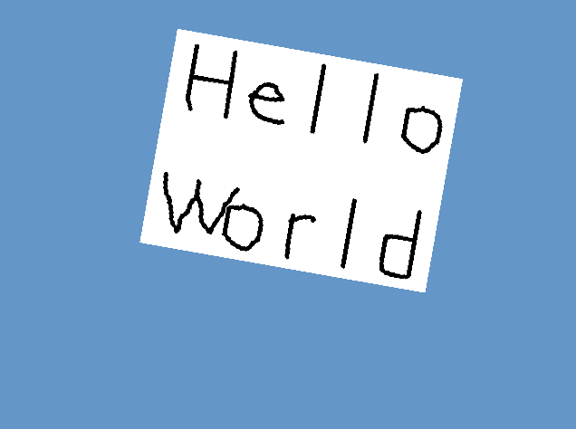
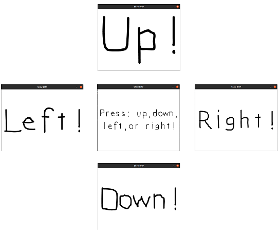
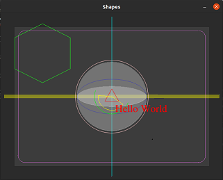
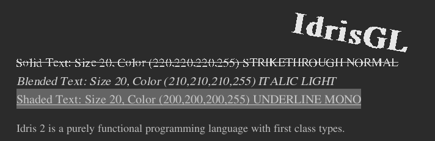
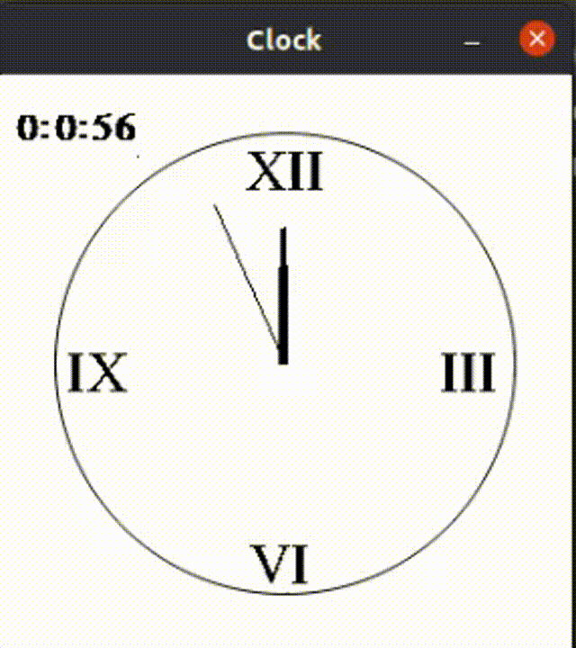

# IdrisGL
A Graphics Library for Idris2, based on SDL2.

- Provides painless functions to build 2D vector graphics, animations and simulations.
- Also provides `SDL2` , `SDL2_image` , `SDL2_gfx`,  `SDL2_ttf` bindings.
- Supports most of keyboard events.
- 2D Shapes.
- Animations (In Progress).
- Simulations (Not yet).

## Build

1. Navigate to `src`.
2. `$ idris2 --build idrisGL.ipkg` builds the libraries.
3. `$ idris2 --install idrisGL.ipkg` installs the packages into Idris2 prefix.
4. `$ idris2 --clean idrisGL.ipkg` cleans everything.

## Dependencies

- SDL2
- SDL2 Image
- SDL2 GFX
- SDL2 TTF

## Samples

`$ idris2 -p idrisGL IdrisGL.idr` to load dependencies.

### Displaying a bmp file or showing pictures in other formats.

- `samples/showBMP/ShowBMP.idr`
- `samples/showIMG/ShowIMG.idr`
- `display <Window> <Background> <Images>`
- Or use SDL2 binding functions.

### Handling Key Presses Events

- `samples/keyPresses/KeyPresses.idr`
- Press [ Up | Down | LEFT | RIGHT ] buttons to switch between pics.
- Another example of using bindings.

### Draw shapes

- `sample/drawShapes/DrawShapes.idr`
- `display <Window> <Background> <Shapes>`

### Displaying text

- `sample/text/Text.idr`
- `display <Window> <Background> <Texts>`

### Animation - Clock

- `sample/animateClock/Clock.idr`
- `animate <Window> <Background> <Time -> Pictures>`

