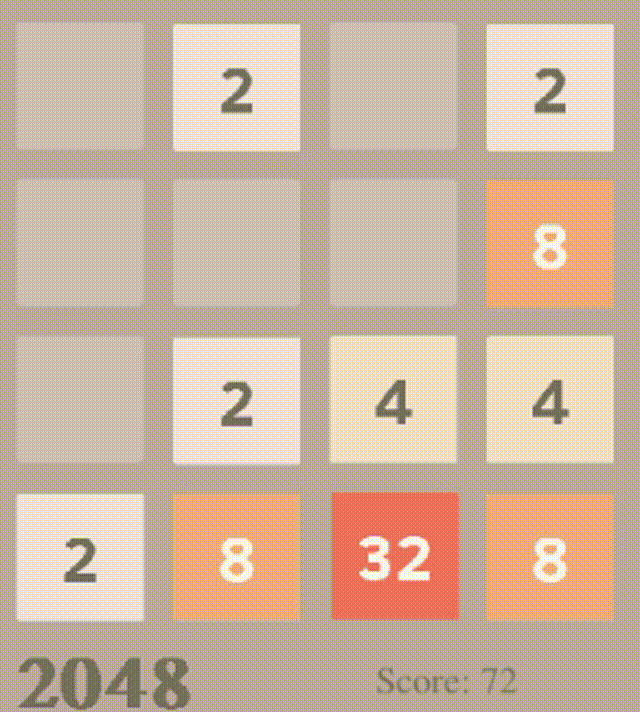

# Idris2GL
A Graphics Library for Idris2, based on SDL2.

- Provides functions to build 2D vector graphics, animations, simulations and games.
- Provides `SDL2` , `SDL2_image` , `SDL2_gfx`,  `SDL2_ttf` bindings, by importing `IdrisGL.SDL`.
- Supports most of keyboard events and mouse events.
- Frames per second control.

## Uses

### Build

1. Navigate to `src`.
2. `$ idris2 --build idrisGL.ipkg` builds the libraries.
3. `$ idris2 --install idrisGL.ipkg` installs the packages into Idris2 prefix.
4. `$ idris2 --clean idrisGL.ipkg` cleans everything.

### Import

`$ idris2 -p idrisGL` to load dependencies.

- `import IdrisGL`: Basic `IdrisGL` functions.
- `import IdrisGL.Color`: Predefined colors.
- `import IdrisGL.Random`: Unsafe, predictable and limited randomness, for users who need (inaccurate) random data to test graphics. (May be deleted in the future.)
- `import IdrisGL.SDL`: `SDL2`, `SDL2_image`, `SDL2_gfx`, `SDL2_ttf` bindings. (Not recommended)

## Tutorial

*(A comprehensive tutorial / user guide will be provided soon.)*

A summary of the four basic kinds of functions:

1. Open a new window and display the given picture. You could draw your own picture with `IdrisGL`.

   ```
   display : (window  : Display)
          -> (bgColor : Color)
          -> (pic     : Picture) 
          -> IO ()
   ```

2. Open a new window and display the given animation.

   ```
   animate : (window  : Display)
          -> (bgColor : Color)
          -> (tpf     : Double)
          -> (picF    : (Double -> Picture))
          -> IO ()
   ```

3. Run a simulation in a window by giving it a model and functions to manipulate it.

   ```
   simulate 
     :  (window  : Display)
     -> (bgColor : Color)
     -> (tpf     : Double)
     -> model
     -> (m2p     : (model  -> Picture))
     -> (m2m     : (Double -> model -> model))
     -> IO ()
   ```

   Or giving it a mutable state:

   ```
   simulateState
     :  (window  : Display)
     -> (bgColor : Color)
     -> (tpf     : Double)
     -> stateType
     -> (m2p     : StateT stateType IO Picture)
     -> (m2m     : Double -> StateT stateType IO ())
     -> IO ()
   ```

4. Play a game in a window. Like simulate, but you manage your own input events.

   ```
   play 
     :  (window  : Display)
     -> (bgColor : Color)
     -> (tpf     : Double)
     -> world
     -> (w2p     : world  -> Picture)
     -> (ew2w    : Eve    -> world -> world)
     -> (tw2w    : Double -> world -> world)
     -> IO ()
   ```

   Or giving it a mutable state:

   ```
   playState 
     :  (window  : Display)
     -> (bgColor : Color)
     -> (tpf     : Double)
     -> stateType
     -> (w2p     : StateT stateType IO Picture)
     -> (e2w     : Eve    -> StateT stateType IO ())
     -> (t2w     : Double -> StateT stateType IO ())
     -> IO ()
   ```

## Samples

### Display - BMP file or showing pictures in other formats.

- `samples/display_showBMP/ShowBMP.idr`
- `samples/display_showIMG/ShowIMG.idr`
- Or use SDL2 binding functions.


### SDL bindings example - Handling Key Presses Events

- `samples/keyPresses/KeyPresses.idr`
- Press [ Up | Down | LEFT | RIGHT ] buttons to switch between pics.
- Another example of using bindings.


### Display - Draw shapes

- `sample/display_drawShapes/DrawShapes.idr`

```
display : Display -> Color -> Picture -> IO ()
```


### Display - Text

- `sample/display_text/Text.idr`

```
display : Display -> Color -> Picture -> IO ()
```


### Animation - Clock

- `sample/animate_clock/Clock.idr`

```
animate : Display 
       -> Color 
       -> Double
       -> (Double -> Picture)
       -> IO ()
```


### Simulation - K-means clustering

- `sample/simulation_kmeans/Kmeans.idr`

```
simulate : Display 
        -> Color 
        -> Double
        -> model
        -> (model  -> Picture)
        -> (Double -> model -> model)
        -> IO ()
```


### Play / Play with mutable state - Mouse Event

- `sample/play_mouseEvents/Mouse.idr`
- Mouse motion.
- Mouse buttons (down/up).
- Mouse wheel.

```
play : Display 
    -> Color
    -> Double
    -> world
    -> (world   -> Picture)
    -> (Eve     -> world -> world)
    -> (Double  -> world -> world)
    -> IO ()
```


### Play - A Simple RPG

- `sample/play_game/Game.idr`
- A very simple 2D RPG.
- W: Go up | S: Go down | A: Go left | D: Go right

```
play : Display 
    -> Color
    -> Double
    -> world
    -> (world   -> Picture)
    -> (Eve     -> world -> world)
    -> (Double  -> world -> world)
    -> IO ()
```


### Play with mutable state - 2048

- `sample/play_2048/Game.idr`
- Materials from https://play2048.co/.



## Dependencies

- SDL2
- SDL2 Image
- SDL2 GFX
- SDL2 TTF

## Thanks

- Idris2 `https://github.com/edwinb/Idris2`
- Gloss `https://github.com/benl23x5/gloss`