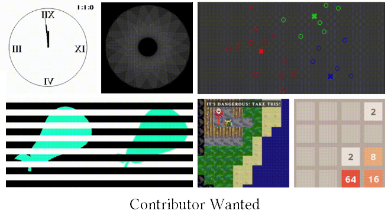

# Idris2GL


A 2D graphic library for Idris 2, which is inspired by Gloss. IdrisGL uses SDL under the hood, but you won’t need to worry about any of that.




- Provides functions to build 2D vector graphics, animations, simulations and games.
- Supports most keyboard events and mouse events.
- Frames per second control.
- Audio and sound effects.

## Documentation

[Documentation for the IdrisGL](https://idrisgl.readthedocs.io/)

## Dependencies

- SDL2
- SDL2 Image
- SDL2 GFX
- SDL2 TTF
- SDL2 Mixer

```
sudo apt update && sudo apt upgrade
sudo apt-get install libsdl1.2-dev libsdl-image1.2-dev libsdl-mixer1.2-dev libsdl2-image-dev libsdl2-ttf-dev libsdl2-gfx-dev libsdl2-mixer-dev
```

## Install

### Installation with [Pack](https://github.com/stefan-hoeck/idris2-pack) (Unverified)

- Install all the dependencies using the commands above.
- `pack install idrisGL`

### Install from Source Code

- `git clone https://github.com/ECburx/Idris2GL`
- Navigate to the directory: `cd Idris2GL`
- If you have installed all the dependencies, `make install`
- Otherwise, `make quickInstall`. This will install the dependencies for you.

## Import

`$ idris2 -p idrisGL` to load dependencies.

- `import IdrisGL`: basic IdrisGL functions.
- `import IdrisGL.Color`: predefined colors.`
- `import IdrisGL.Random`: unsafe, predictable and limited randomness, for users who need random data to test graphics. (May be removed in the future.)
- `import IdrisGL.SDL`: SDL2, SDL2_image, SDL2_gfx, SDL2_ttf bindings.

## Thanks

- Dr [Edwin Brady](https://github.com/edwinb)

## Maintenance

**Contributions will be gratefully welcomed!**

- Maintainer: [Tian Z](https://github.com/ECburx)

