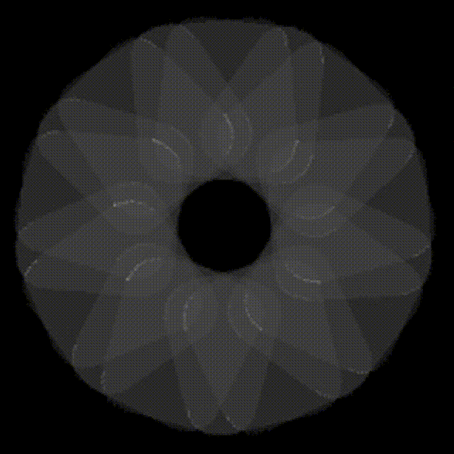
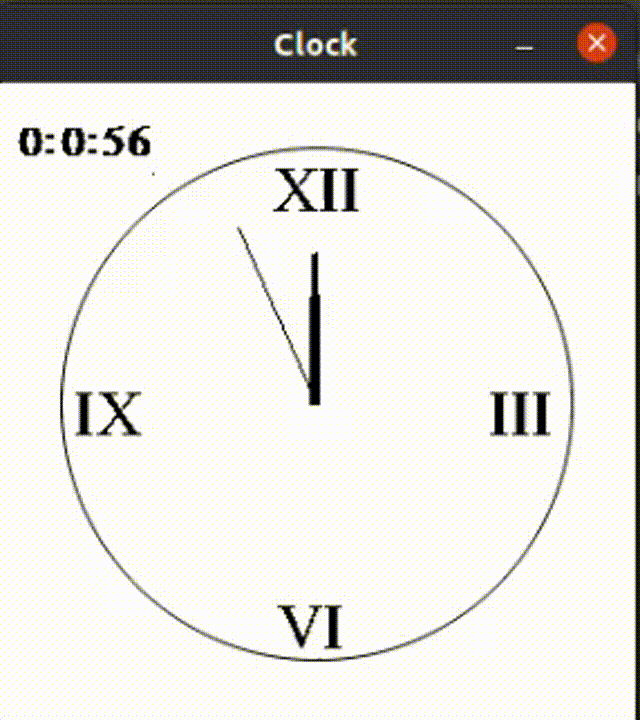
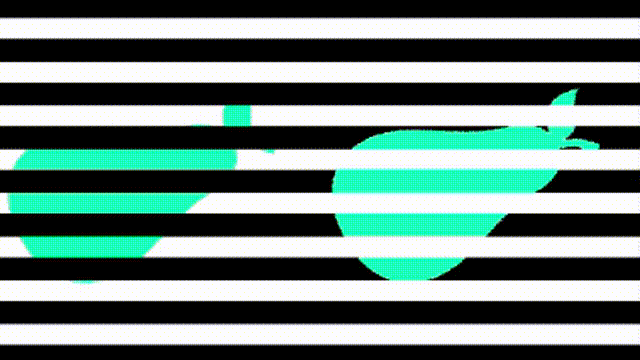

.. _sect-animate:

*********
Animation
*********

You’ve now seen how to display pictures in a window.

In this chapter, we will look at animation, bringing stories to our pictures.

Display Pictures at A Specific Time
===================================

``animate`` function opens a new window and display the given animation.
Animation in IdrisGL is actually displaying different pictures at different time.
``animate`` function pass a certain time (the seconds since IdrisGL set up) to you,
and you decide the picture in this specific time. Let's take a look at ``animate``
prototype at first:

.. code-block:: idris
   :caption: ``animate``

   animate : (window  : Display)
          -> (bgColor : Color)
          -> (tpf     : Double)
          -> (picF    : (Double -> Picture))
          -> IO ()

Similarly to ``display``, ``window : Display`` describes how IdrisGL should display a window,
in window or full scrren. ``bgColor : Color`` is the background color of the window.

``tpf : Double`` takes a double value, **time per frame**,
which is the number of seconds to display each frame of animation.
Setting ``tpf`` to ``0.1`` means IdrisGL would display ``1/0.1 = 10`` frames per second.
``tpf`` used to control frames per second (FPS), used to control the best display effect.
For example, preventing the animation from being displayed too fast and being unable to be captured by our eyes;
or the calculation speed of each frame is too slow, which causes FPS to change.

.. note::

   Setting ``tpf`` to ``0`` means IdrisGL displays every frame as fast as possible.

``picF : (Double -> Picture)`` takes a user-defined function.
``animate`` passes the seconds since IdrisGL set up to the first ``Double`` parameter,
and then displays the output ``Picture`` on the screen.

We will start by an example we have already used in last chapter,
rotating 10 rounded rectangles with the same initial position.
This time let's make an animation of two sets of rounded rectangles rotating in different directions.

.. code-block:: idris
   :caption: A simple animation of rotation
   :emphasize-lines: 22,23,24,25,26,29

   window : Display
   window = InWindow "My First Window" (MkRect 30 50 300 300)
   
   -- Generates an infinite stream of increasing sequence.
   plus40s : (n : Double) -> Stream Double
   plus40s  n = n :: plus40s (40 + n)

   -- Generates an infinite stream of decreasing sequence.
   minus40s : (n : Double) -> Stream Double
   minus40s n = n :: minus40s (n - 40)

   -- Rotate a rounded rectangle generater.
   rotateRect : (angle : Double) -> Picture
   rotateRect angle = 
      let center = MkCoor 150 150           -- rotation center
          pos    = MkRect 100  20 100 100   -- each rectangle is in the same position before being rotated
          color  = MkRGBA 255 255 255  80
          rect   = R_Rectangle pos color True 20
       in Rotate angle center rect

   -- Generates 10 rectangles, with each one rotated in different angles.
   rects : (time : Double) -> Picture
   rects time = 
       Pictures $ 
           (rotateRect <$> take 9 (plus40s  $ 40 * time)) ++
           (rotateRect <$> take 9 (minus40s $ 30 * time))

   main : IO ()
   main = animate window Color.black 0.1 rects

An Example of Clock Animation
=============================

`Example Code: Clock
<https://github.com/ECburx/Idris2GL/tree/main/samples/animate_clock/>`_

Firstly, let's define function ``clock_Hand``
which generates a clock hand pointing to a time, with specified length and thickness.

.. code-block:: idris

   clock_Hand : (time : Int) -> (length : Int) -> (thickness : Int) -> Picture
   clock_Hand time length thickness =
      ThickLine center (MkCoor x y) Color.black thickness
      where angle : Double
            angle = (cast $ mod time 60) * pi / 30
            x     : Int 
            x     = cast $ 150.0 + sin angle * (cast length)
            y     : Int
            y     = cast $ 150.0 - cos angle * (cast length)

Secondly, we need a function to take the time in seconds IdrisGL passed.
It generates three clock hands: second hand, minute hand and hour hand.
And it calculates the time (angle) these clock hands pointed to.
Finally, we add the number on the clock to the list of pictures.

.. code-block:: idris
   :caption: Function to take the time in seconds IdrisGL passed

   clock : Double -> Picture
   clock s = let s' : Int = cast s in
               Pictures ([Circle     center Color.black False 120
                        ,clock_Hand s'                   90  1    -- second
                        ,clock_Hand (cast $ div s' 60)   70  4    -- minute
                        ,clock_Hand (cast $ div s' 1200) 50  6    -- hour
                        ,clock_Text s'] ++ clock_Number)

Since the smallest unit of time that this clock can display is second, we can set Times Per Frame to 1.

.. code-block:: idris

   main : IO ()
   main = animate (InWindow "Clock" (MkRect 50 50 300 300)) Color.white 1 clock

An Example of Moving Optical Illusions
======================================

`Example Code: Illusions
<https://github.com/ECburx/Idris2GL/tree/main/samples/animate_illusion/>`_

Tricks derived from `Lenstore <https://www.lenstore.co.uk/vc/moving-perspectives/#>`_.

*Some optical illusions are mind-bending enough, but those that move can truly baffle.
Despite one pear looking darker than the other underneath the black and white lines,
they're both actually the same colour. This mechanism is an example of a brightness illusion.* [1]_

In previous section, you've already know how to rotate a picture.
Let's practice again by wrting a function ``leftPear`` that rotates
the pear on the left hand side 40 degrees each second.
(size of "pear.png": 150*300)

.. code-block:: idris

   leftPear : (time : Double) -> Picture
   leftPear time = Rotate (time * 40) (MkCoor 125 150) (Image "pear.png" (MkRect 50 0 150 300))

With adding the pears on the right hand side and black and white tapes,
we can create wonderful moving optical illusions.

.. code-block:: idris

   timeHandler : (t : Double) -> Picture
   timeHandler t = Pictures $ leftPear t :: blackTapes t ++ [rightPear t] ++ whiteTapes t

   main : IO ()
   main = animate window Color.white 0.05 timeHandler

.. [1] https://www.lenstore.co.uk/vc/moving-perspectives/#