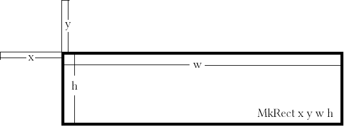

.. _sect-datatypes:

***************************
A Start Guide of Data Types
***************************

This is a simple start guide of data types which be frequently used in IdrisGL, which helps
beginers have a look of how IdrisGL works.
You can find a more detailed description of them in documentation and the list of data types.

Coordinates
===========

A position on the screen can be described by a coordinate.
And the position of a pixel can also be considered as a coordinate.
``Coordinate`` is one of the data types which can be used to describe location information.

.. code-block:: idris

   data Coordinate : Type where
      ||| @ x X coordinate of the point.
      ||| @ y Y coordinate of the point.
      MkCoor : (x : Int) -> (y : Int) -> Coordinate

``Coordinate`` takes two parameters, *x* coordinate and *y* coordinate.
For example, ``MkCoor 10 50`` indicates (10, 50) on the screen,
represending a position with a horizontal distance of *x* and a vertical distance of *y*
from the top left corner of the screen.

Rectangle
=========

``Rect`` is used to described a rectangle area.

.. code-block:: idris

   data Rect : Type where
      ||| @ x X coordinate of the start point.
      ||| @ y Y coordinate of the start point.
      ||| @ w The width of the rectangle area.
      ||| @ h The height of the rectangle area.
      MkRect : (x : Int) -> (y : Int) -> (w : Int) -> (h : Int) -> Rect

The first two ``Int`` values indicate the start point of the rectangle area.
And the last two ``Int`` values indicate the width and height of the rectangle area.

For example, ``MkRect 30 50 100 200`` describes a rectangle whose upper left corner is at (30, 50),
with a width of 100 and a height of 200.

Colors
======

IdrisGL supports RGB and RGBA colors.

.. code-block:: idris

   data Color : Type where
        MkRGBA : (r : Int) -> (g : Int) -> (b : Int) -> (a : Int) -> Color
        MkRGB  : (r : Int) -> (g : Int) -> (b : Int) -> Color

Or you can ``import IdrisGL.Color`` to use predefined colors, such as red, green and blue.

Window
======

``Display`` data type describes how IdrisGL should display a window.

.. code-block:: idris
   
   data Display
     = InWindow String Rect
     | FullWindow

-  ``InWindow <title> <window_pos_size>`` describes a window with the given title, position and size.
-  ``FullWindow`` displays full screen.

The following function describes a window starting at coordinates (30, 50),
with a width of 600 and a height of 300.

.. code-block:: idris
   
   window : Display
   window = InWindow "My First Window" (MkRect 30 50 600 300)

Picture
=======

Data type ``Picture`` declares all available window elements and their operations in Idris.
Here are a few commonly used ``Picture`` elements:

-  A blank picture with nothing in it.

   .. code-block:: idris
      
      Blank : Picture

-  A line from one coordinate to the other, with specified color.

   .. code-block:: idris
      
      ||| @ start     The start position.
      ||| @ end       The end position.
      ||| @ color     The color of line.
      Line 
         :  (start : Coordinate) 
         -> (end   : Coordinate) 
         -> (color : Color) 
         -> Picture

-  A rectangle describes by a ``Rect``, with specified color and filling options.

   .. code-block:: idris

      ||| @ rect    The size of position of the rectangle.
      ||| @ color   The color of the rectangle.
      ||| @ filling True if fill the rectangle. 
      Rectangle 
         :  (rect    : Rect) 
         -> (color   : Color) 
         -> (filling : Bool) 
         -> Picture

We will discuss more pictures, shapes and operations of these in following chapters.

Events
======

If you don't want to handles input events (from computer devices),
you won't need to worry about this data type.
This data type is only used when *playing* something.

``Eve`` describes all available user input events in IdrisGL.
The ``play`` functions passes these events to you,
and you decides how to change medias corresponding with different events.

.. code-block:: idris

   data Eve 
      = ||| Unavailable event.
      E_UNAVAILABLE
      | ||| Quit event.
      E_QUIT

      {- Key events -}

      | ||| Key pressed event.
      E_KEYDOWN Key
      | ||| Key release event.
      E_KEYUP   Key

      {- Mouse events -}

      | ||| Moving mouse and its position.
      E_MOUSEMOTION     (Int, Int)
      | ||| Mouse button pressed and its position.
      E_MOUSEBUTTONDOWN (Int, Int)
      | ||| Mouse button released and its position.
      E_MOUSEBUTTONUP   (Int, Int)
      | ||| Mouse wheel event and its position.
      E_MOUSEWHEEL      (Int, Int)

``Key`` in key events is a data type represending different keyboard events.
For example, ``E_KEYUP EK_RETURN`` means releasing the *Return* button.

You can find all supported events in **Supported Events**.