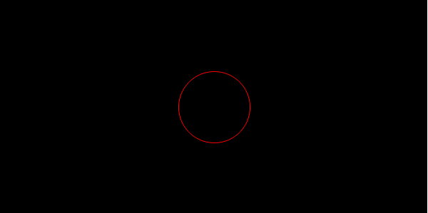
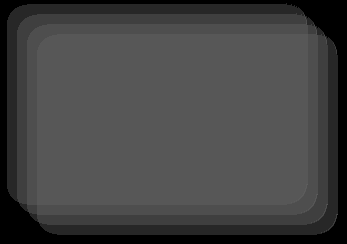
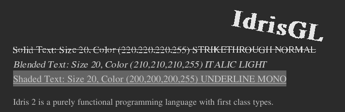
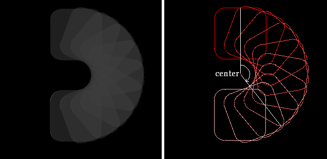
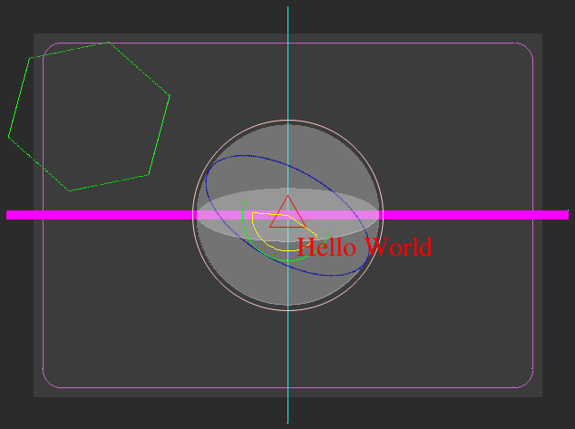

.. _sect-display:

*******
Display
*******

Display a Picture
=================

``display`` function opens a new window and display the given picture.

.. code-block:: idris

   ||| @ window  Display mode.
   ||| @ bgColor Background color.
   ||| @ pic     Picture.
   display : (window  : Display)
          -> (bgColor : Color)
          -> (pic     : Picture) 
          -> IO ()

``Picture`` data type provides a constructor which draws a cicle with the
given radius, color and filling. For example,
``Circle (MkCoor 30 50) Color.red False 30`` is a red circle whose center is
at (30, 50) and radius is 30 pixels.

.. code-block:: idris

   ||| @ center  The center of the circle.
   ||| @ color   The color of the circle.
   ||| @ filling True if fill the circle.
   ||| @ radius  The radius of the circle.
   Circle 
      :  (center  : Coordinate) 
      -> (color   : Color) 
      -> (filling : Bool) 
      -> (radius  : Int) 
      -> Picture

Following ``main`` displays a circle in the middle of the window.

.. code-block:: idris
   :emphasize-lines: 13

   module MyFirstWindow

   import IdrisGL
   import IdrisGL.Color as Color

   window : Display
   window = InWindow "My First Window" (MkRect 30 50 600 300)

   circle : Picture
   circle = Circle (MkCoor 300 150) Color.red False 50

   main : IO ()
   main = display window Color.black circle

To execute the ``main`` function:

::

   $ idris2 -p idrisGL
   Main> :l "MyFirstWindow.idr"
   MyFirstWindow> :exec main

Multiple Pictures
=================

Constructor ``Pictures : (pics : List Picture) -> Picture`` is a picture consisting of several others.
Note that the picture at the end of the list is always displayed above the one at the head of the list,
especially when drawing shapes with translucent colors.

.. code-block:: idris
   :emphasize-lines: 10

   -- A rounded rectangle generater.
   rect : (x : Int) -> Picture
   rect x = R_Rectangle (MkRect x x 300 200) (MkRGBA 100 100 100 100) True 20

   -- Generates four rectangles.
   rects : Picture
   rects = Pictures $ rect <$> [10,20,30,40]

   main : IO ()
   main = display window Color.black rects

.. note::

   | **Thickness of Shapes**
   | Some constructors allow you to specify thickness of the drawing line.
     For example, ``ThickLine`` and ``ThickCircle``.

   .. code-block:: idris

      ThickLine 
         :  (start     : Coordinate) 
         -> (end       : Coordinate) 
         -> (color     : Color) 
         -> (thickness : Int) 
         -> Picture

Showing Text
============

IdrisGL doesn't provide a built-in font family, meaning you have to provide a font
file and pass the file path to IdrisGL. You can find a *free serif* font file
in samples in repo (``/sample``).

There are four constructors of showing text.
The easiest way to show a string of text is using ``Text`` constructor.

-  | Blended text with default settings.
   | In this case, you don't need to specify text settings such as style.

      .. code-block:: idris

         ||| @ text  Text.
         ||| @ size  Font size.
         ||| @ font  Path of font file.
         ||| @ pos   Position of text.
         ||| @ color The color of text.
         Text 
            :  (text  : String) 
            -> (size  : Int) 
            -> (font  : String)
            -> (pos   : Coordinate) 
            -> (color : Color) 
            -> Picture

Sometimes, you may need to add some text styles, hinting and kerning.
IdrisGL provides five font styles:

.. code-block:: idris

   data TextStyle = TS_NORMAL | TS_BOLD | TS_ITALIC | TS_UNDERLINE | TS_STRIKETHROUGH

and four hinting settings:

.. code-block:: idris

   data TextHinting = TH_NORMAL | TH_LIGHT | TH_MONO | TH_NONE

Following three constructors helps you to draw a string of text with custom details.

-  Solid text.

      .. code-block:: idris

         ||| @ style   Font style.
         ||| @ hinting Hinting.
         ||| @ kerning Kerning.
         SolidText 
            :  (text    : String) 
            -> (size    : Int)
            -> (font    : String) 
            -> (pos     : Coordinate) 
            -> (color   : Color) 
            -> (style   : TextStyle) 
            -> (hinting : TextHinting) 
            -> (kerning : Int) 
            -> Picture

-  Blended text.

      .. code-block:: idris

         BlendedText 
            : (text     : String) 
            -> (size    : Int) 
            -> (font    : String) 
            -> (pos     : Coordinate) 
            -> (color   : Color) 
            -> (style   : TextStyle) 
            -> (hinting : TextHinting) 
            -> (kerning : Int) 
            -> Picture

-  Shaded text. (Blended text with background color)

      .. code-block:: idris

         ||| @ bgColor The background color.
         ShadedText 
            :  (text    : String) 
            -> (size    : Int) 
            -> (font    : String) 
            -> (pos     : Coordinate) 
            -> (color   : Color) 
            -> (bgColor : Color)
            -> (style   : TextStyle) 
            -> (hinting : TextHinting) 
            -> (kerning : Int) 
            -> Picture

Loading Images
==============

IdrisGL allows you to load images with format in
``*.bmp``, ``*.jpg``, ``*.png``, ``*.webp``, ``*.tif``.
However, to improve the efficiency, we use constructor ``Bitmap`` to load only bitmaps,
``Image`` for image in other formats. Similarly to rectangle, we use ``Rect`` to
specify the position and size of the image.

.. code-block:: idris
   :linenos:

   bmp : Picture
   bmp = Bitmap "hello_world.bmp" <bmpRect>

   jpg : Picture
   jpg = Bitmap "hello_world.jpg" <jpgRect>

Rotation
========

IdrisGL allows you to rotate a picture,
which rotated clockwise by the given angle (in degrees) and given center.

.. code-block:: idris

   ||| @ angle   Rotation angle.
   ||| @ center  Rotation center.
   ||| @ pic     The picture to be rotated.
   Rotate 
      :  (angle  : Double) 
      -> (center : Coordinate) 
      -> (pic    : Picture) 
      -> Picture

For example, let's rotate 10 rectangles with the same initial position:

.. code-block:: idris
   :emphasize-lines: 15,16,19

   -- Generates an infinite stream of increasing sequence.
   plus20s : (n : Double) -> Stream Double
   plus20s n = n :: plus20s (20 + n)

   -- Rotate a rounded rectangle generater.
   rotateRect : (angle : Double) -> Picture
   rotateRect angle = 
      let center = MkCoor 150 150           -- rotation center
          pos    = MkRect 100  20 100 100   -- each rectangle is in the same position before being rotated
          color  = MkRGBA 120 120 120 120
          rect   = R_Rectangle pos color True 20
      in Rotate angle center rect

   -- Generates 10 rectangles, with each one rotated in different angles.
   rects : Picture
   rects = Pictures $ rotateRect <$> take 10 (plus20s 0)

   main : IO ()
   main = display window Color.black rects

Other Shapes
============

There are many other useful shapes you may take a look.
The combination of them can give you any picture you want.

-  Pixel.

   .. code-block:: idris

      Pixel 
      :  (position : Coordinate) 
      -> (color    : Color) 
      -> Picture

-  Rounded-corner rectangle. 

   .. code-block:: idris

      ||| @ radius  The radius of the corner arc.
      R_Rectangle 
         :  (rect    : Rect) 
         -> (color   : Color) 
         -> (filling : Bool) 
         -> (radius  : Int) 
         -> Picture

-  Circular arc drawn counter-clockwise between two angles (in degrees).

   .. code-block:: idris

      ||| @ center The center of the arc.
      ||| @ radius The radius of the arc.
      ||| @ start  Starting radius in degrees of the arc. 0 degrees is down, increasing counterclockwise.
      ||| @ end    Ending radius in degrees of the arc. 0 degrees is down, increasing counterclockwise. 
      Arc 
         :  (center : Coordinate) 
         -> (color  : Color) 
         -> (radius : Int) 
         -> (start  : Int) 
         -> (end    : Int) 
         -> Picture

-  Pie (outline) drawn counter-clockwise between two angles (in degrees).

   .. code-block:: idris

      Pie 
         :  (center : Coordinate) 
         -> (color  : Color) 
         -> (radius : Int) 
         -> (start  : Int) 
         -> (end    : Int) 
         -> Picture

-  Ellipse.

   .. code-block:: idris

      ||| @ center  The center of the ellipse.
      ||| @ rx      Horizontal radius in pixels of the ellipse. 
      ||| @ ry      Vertical radius in pixels of the ellipse.
      Ellipse 
         :  (center  : Coordinate) 
         -> (rx      : Int) 
         -> (ry      : Int) 
         -> (color   : Color) 
         -> (filling : Bool) 
         -> Picture

-  Trigon

   .. code-block:: idris
      
      ||| @ point1  The first point.
      ||| @ point2  The second point.
      ||| @ point3  The third point.
      Trigon 
         :  (point1  : Coordinate) 
         -> (point2  : Coordinate) 
         -> (point3  : Coordinate) 
         -> (color   : Color) 
         -> (filling : Bool) 
         -> Picture

-  Polygon

   .. code-block:: idris

      ||| @ points  A list of points.
      Polygon 
         :  (points  : List Coordinate) 
         -> (color   : Color) 
         -> (filling : Bool) 
         -> Picture

An Example of Showing Shapes
============================

`Download Example Code <https://github.com/ECburx/Idris2GL/tree/main/samples/display_drawShapes/>`_

.. code-block:: idris

   import IdrisGL

   font : String
   font = "FreeSerif.ttf"

   shapes : Picture
   shapes = Pictures [Rectangle   (MkRect 40 40 560 400) (MkRGB 60 60 60) True
                     ,R_Rectangle (MkRect 50 50 540 380) (MkRGB 200 100 200) False 20
                     ,Line        (MkCoor 320 10)  (MkCoor 320 470) Color.cyan
                     ,ThickLine   (MkCoor 10  240) (MkCoor 630 240) Color.magenta 10
                     ,Circle      (MkCoor 320 240) (MkRGBA 200 200 200 100) True  100
                     ,Circle      (MkCoor 320 240) (MkRGB  255 200 200) False 105
                     ,Rotate 30   (MkCoor 320 240) (Ellipse (MkCoor 320 240) 100 50 Color.blue False)
                     ,Ellipse     (MkCoor 320 240) 100 30 (MkRGBA 230 230 230 80)  True
                     ,Arc         (MkCoor 320 240) Color.green 50 20 200
                     ,Pixel       (MkCoor 320 240) Color.red
                     ,Trigon      (MkCoor 300 253) (MkCoor 340 253) (MkCoor 320 218) Color.red False
                     ,Pie         (MkCoor 320 240) Color.yellow 40 35 185
                     ,Rotate 15   (MkCoor 50  50)  
                                 (Polygon [MkCoor 120  30 
                                          ,MkCoor  40  70
                                          ,MkCoor  40 160
                                          ,MkCoor 120 200
                                          ,MkCoor 200 160
                                          ,MkCoor 200 70] 
                                          (MkRGB 30 255 30) False)
                     ,Text        "Hello World" 30 font (MkCoor 330 250) Color.red
                     ]

   -- The painless way to show shapes:
   main : IO ()
   main = display 
      (InWindow "Shapes" (MkRect 30 50 640 480))        -- window setting
      (MkRGB 43 43 43)                                  -- background color
      shapes                                            -- Picture

Here is an example of directly using SDL bindings (Not recommended).
You can write like using SDL in C language.

.. code-block:: idris

   import IdrisGL
   import IdrisGL.SDL

   main : IO ()
   main = do 
      win             <- createWin $ InWindow "Shapes" (MkRect 30 50 640 480)
      ren             <- createRenderer win
      setRenderDrawColor ren Color.black

      renderClear        ren
      aaline             ren (MkCoor 10 10) (MkCoor 500 400) Color.green
      thickLine          ren (MkCoor 20 20) (MkCoor 500 300) Color.red 10
      renderPresent      ren

      e               <- newEve
      loop               ren e
      freeRender         ren
      closeWin           win
      where 
         loop : Renderer -> Event -> IO ()
         loop   ren e with (eveType e)
         loop _   _ | E_QUIT = pure ()
         loop ren e | _      = loop ren e

.. warning::

   SDL bindings may be not allowed to access in the future.