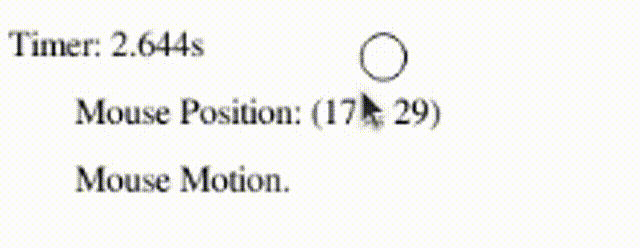
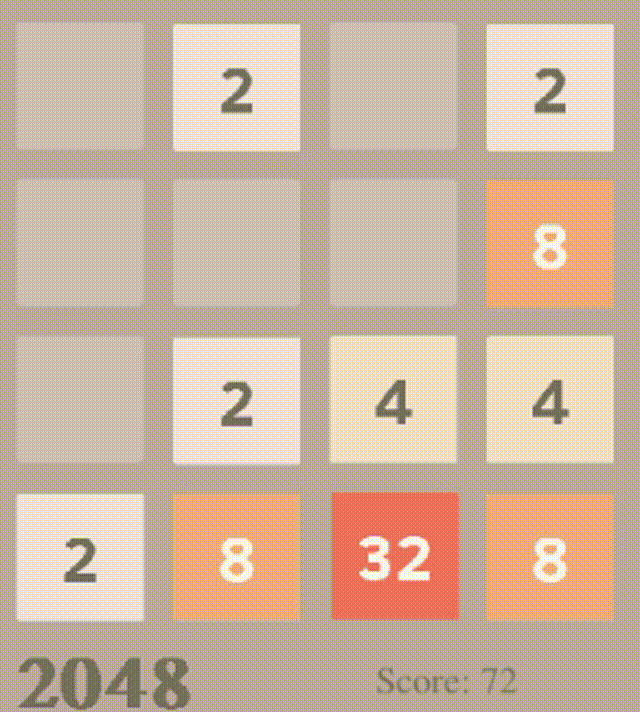
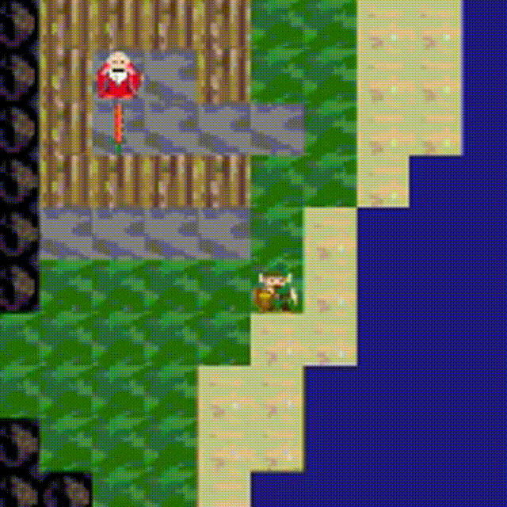

.. _sect-play:

****
Play
****

IdrisGL supports most of the keyboard and mouse events.
It's time to interact our pictures with outside world.

In this chapter, we will handles user-inputed events,
and dig further of StateT in IdrisGL.

Manage Input Events
===================

``play`` plays a game in a window. Like simulate, but you manage your own input events.

.. code-block:: idris
   :caption: ``play``

   play 
     :  (window  : Display)
     -> (bgColor : Color)
     -> (tpf     : Double)
     -> (world   : a)
     -> (w2p     : a      -> Picture)
     -> (ew2w    : Eve    -> a -> a)
     -> (tw2w    : Double -> a -> a)
     -> IO ()

-  ``world``: the initial game world, of some generic type ``a``.
   You can consider it as a model in ``simulate``.
-  ``w2p`` : a function tells IdrisGL how to display a world.
-  ``ew2w``: a function handles input events, and step the world.
-  ``tw2w``: similar to ``m2m`` in ``simulate``, except that it uses the passed time to step the world.
   If the stepping of world doesn't depend on time. Your function can ignore the time IdrisGL passed.

Input events can be divided into three categories:

-  Keyboard events.

   .. code-block:: idris

      data Eve = 
         ...
         | E_KEYDOWN Key
         | E_KEYUP   Key
         ...

-  Mouse events. The tuple gives you the position of mouse in the certain event.

   .. code-block:: idris

      data Eve = 
         ...
         | E_MOUSEMOTION       (Int, Int)
         | E_L_MOUSEBUTTONDOWN (Int, Int)
         | E_M_MOUSEBUTTONDOWN (Int, Int)
         | E_R_MOUSEBUTTONDOWN (Int, Int)
         | E_L_MOUSEBUTTONUP   (Int, Int)
         | E_M_MOUSEBUTTONUP   (Int, Int)
         | E_R_MOUSEBUTTONUP   (Int, Int)
         | E_MOUSEWHEEL        (Int, Int)
         ...

-  Other events

IdrisGL passes those events to you.
Using pattern matching to response to different input events
could be a good idea of implementing ``ew2w``.

An Example of Tracking Mouse Events
===================================

`Example Code: Mouse Events
<https://github.com/ECburx/Idris2GL/tree/main/samples/play_mouseEvents/>`_

Let's take a look at a very simple example of handling mouse events,
starting with defining world data type.

.. code-block:: idris
   
   --              Mouse position  Time   Msg to show
   data World = WD (Int,Int)       Double String

   initWorld : World
   initWorld = WD (0,0) 0 ""

And then focus on events handler:

-  *Define*: a events handler prototype.

   .. code-block:: idris
      :emphasize-lines: 1
      
      eventsHandler : (e : Eve) -> (w : World) -> World
   
-  *Define*: patterns of events we would like to handle.

   .. code-block:: idris
      :emphasize-lines: 2,3,4,5
      
      eventsHandler : (e : Eve) -> (w : World) -> World
      eventsHandler (E_MOUSEMOTION       (x,y)) w = ?eventsHandler_rhs_1
      eventsHandler (E_L_MOUSEBUTTONDOWN (x,y)) w = ?eventsHandler_rhs_2
      eventsHandler (E_L_MOUSEBUTTONUP   (x,y)) w = ?eventsHandler_rhs_3
      eventsHandler (E_MOUSEWHEEL        (x,y)) w = ?eventsHandler_rhs_4
      
-  *Refine*: track the position of mouse.

   .. code-block:: idris
      :emphasize-lines: 2,3,4,5

      eventsHandler : Eve -> World -> World
      eventsHandler (E_MOUSEMOTION       (x,y)) (WD _ t _) = WD (x,y) t "Mouse Motion."
      eventsHandler (E_L_MOUSEBUTTONDOWN (x,y)) (WD _ t _) = WD (x,y) t "Mouse Button Down."
      eventsHandler (E_L_MOUSEBUTTONUP   (x,y)) (WD _ t _) = WD (x,y) t "Mouse Button Up."
      eventsHandler (E_MOUSEWHEEL        (x,y)) (WD _ t _) = WD (x,y) t "Mouse Wheel."

-  Finally, ignoring other events.

   .. code-block:: idris
      :emphasize-lines: 6

      eventsHandler : Eve -> World -> World
      eventsHandler (E_MOUSEMOTION       (x,y)) (WD _ t _) = WD (x,y) t "Mouse Motion."
      eventsHandler (E_L_MOUSEBUTTONDOWN (x,y)) (WD _ t _) = WD (x,y) t "Mouse Button Down."
      eventsHandler (E_L_MOUSEBUTTONUP   (x,y)) (WD _ t _) = WD (x,y) t "Mouse Button Up."
      eventsHandler (E_MOUSEWHEEL        (x,y)) (WD _ t _) = WD (x,y) t "Mouse Wheel."
      eventsHandler _ w = w

Apart from that, we'd only need to handle time and tell IdrisGL how to display our world.

.. code-block:: idris

   showWD : World -> Picture
   ...

   timeHandler : Double -> World -> World
   timeHandler t (WD xy _ s) = WD xy t s

   main : IO ()
   main = play window 0.01 initWorld showWD eventsHandler timeHandler

Play with Mutable State
=======================

*Idris is a pure language, so variables are immutable. Once a variable is defined with
a value, nothing can update it. This might suggest that writing programs that
manipulate state is difficult, or even impossible, or that Idris programmers in general
aren’t interested in state. In practice, the opposite is true.* [1]_

You've seen ``simulateStateT`` in last chapter, and you know that
almost all real-world applications need to manipulate state.
As we discussed, StateT is the monad transformer for the State monad.
``playStateT`` allows you to manipulate mutable state with ``State`` and associated functions,
connecting/composing/linking functions.

.. code-block:: idris
   :caption: ``playStateT``

   playStateT
      :  (window    : Display)
      -> (bgColor   : Color)
      -> (tpf       : Double)
      -> (stateType : a)
      -> (w2p       : StateT a IO Picture)
      -> (e2w       : Eve    -> StateT a IO ())
      -> (t2w       : Double -> StateT a IO ())
      -> IO ()

Let's continue to refine our mouse events example.
``eventsSTHandler`` reads the state using ``get`` and then updates it
using ``put``.

.. code-block:: idris

   import Control.Monad.State

   eventsSTHandler : (event : Eve) -> StateT World IO ()
   eventsSTHandler event = do
      world@(WD _ t _) <- get
      case event of
         E_MOUSEMOTION       pos => put $ WD pos t "Mouse Motion."
         E_L_MOUSEBUTTONDOWN pos => put $ WD pos t "Mouse Button Down."
         E_L_MOUSEBUTTONUP   pos => put $ WD pos t "Mouse Button Up."
         E_MOUSEWHEEL        pos => put $ WD pos t "Mouse Wheel."
         _                       => put world

The effect of the code is the same as above (using ``play``).

However, we don't like "impure functions": functions that yield different output for same input.
So it is wise to take some time to consider using which function.

Using IO Functions in ``playStateT``
====================================

Sound Effects and Music
^^^^^^^^^^^^^^^^^^^^^^^

Up until now you've seen how Monad State could work in IdrisGL.
Most games made require some sort of sound and here we'll be using **IO functions**
in ``playStateT`` to play audio for us.

-  | ``playMusic``: Play music, with looping.
   | ``@ loops`` : number of times to play through the music. 0 plays the music zero times.
     -1 plays the music forever (or as close as it can get to that).

   .. code-block:: idris

      playMusic : HasIO io => (path : String) -> (loops : Int) -> io ()

-  | ``playChunk``: Play a sound effect in an available channel one times.

   .. code-block:: idris

      playChunk : HasIO io => (path : String) -> io ()

Game 2048 in next section gives you an example of using IO functions in ``playStateT``.

.. warning::

   Only support music in ``.wav`` format for now.

.. Note::

   You can also use IO functions, such as playing sound effects and musics, in ``simulateStateT``.

Design a Game: 2048
===================

`Example Code: 2048
<https://github.com/ECburx/Idris2GL/tree/main/samples/play_2048/>`_

Picture material from `https://play2048.co/ <https://play2048.co/>`_. [2]_

*Tiles with the same number merge into one when they touch. Add them up to reach 2048!* [2]_

-  Data type of 2048 world, contains a board of 16 tiles,
   player score and the maximum tile on the board.
   If ``max`` equals 2048, the play win the game.

   .. code-block:: idris

      data WorldState   : Type where
           MkWorldState : (board : Board) -> (score : Nat) -> (max : Nat) -> WorldState
      
      initWorld : WorldState
      initWorld = MkWorldState initBoard 0 0

-  Data type of 2048 board.
   Expressing a tile by a ``Nat``, the board would be a 2D (4*4) ``Nat`` matric.
   If a tile is empty, we say this tile is 0. An initial board always has two tiles,
   so adding two random generated tiles to an empty board.

   .. code-block:: idris

      data Board : Type where
         MkBoard : (board : Vect 4 (Vect 4 Nat)) -> (lose : Bool) -> Board
      
      emptyBoard : Board
      emptyBoard = MkBoard (replicate 4 (replicate 4 0)) False

      addTile : (board : Board) -> Board

      initBoard : Board
      initBoard = addTile $ addTile emptyBoard

-  Data type of all acceptable operations.

   .. code-block:: idris

      data Operation = Up | Down | Left | Right

-  A function ``zeros`` returns all empty tiles on a board.

   .. code-block:: idris

      zeros : (board : Board) -> List (Fin 4, Fin 4)

-  Dependent data type of describing if a board is movable.
   And a function ``isAbleToMove`` checks if a board is able to be moved,
   using ``Dec``.
   If it's able to be movec,
   before the board moves or after moving in a certain direction,
   there are always one or more tiles that are empty.
   And then a proof of "unable to move a board".
   If a board is no longer to be moved, the play lose.

   .. code-block:: idris
      :emphasize-lines: 1,6,9

      data Movability : List (Fin 4, Fin 4) -> Type where
         Able :  (possibility   :      (Fin 4, Fin 4)) 
              -> (possibilities : List (Fin 4, Fin 4)) 
              -> Movability $ possibility :: possibilities
      
      unableToMove : Movability [] -> Void
      unableToMove _ impossible
      
      isAbleToMove : (board : Board) -> Dec $ Movability $ zeros board
      isAbleToMove board = isAbleToMove' $ zeros board
      where 
         isAbleToMove' : (ps : List (Fin 4, Fin 4)) -> Dec $ Movability ps
         isAbleToMove' Nil     = No unableToMove
         isAbleToMove' (p::ps) = Yes $ Able p ps

-  *The merge function can be directly applied when the board is moved to the left.
   The other directions require a little bit of thought, if the code is supposed to remain clean.
   Moving the grid to the right is done by taking each row, reversing it before handing it off to the function ‘merge’,
   and then reversing the result again* [3]_:

   .. code-block:: idris
      :emphasize-lines: 5, 10, 20, 21, 22, 23, 26, 27, 28

      upMergeLine : Vect 4 Nat -> Vect 4 Nat
      upMergeLine line = combine $ reformat line
      where
         reformat : Vect m Nat -> Vect m Nat
         reformat (0::ts) = snoc (reformat ts) 0
         reformat (t::ts) = t :: reformat ts
         reformat Nil     = Nil

         combine  : Vect m Nat -> Vect m Nat
         combine (x::y::xs) with (x == y)
            combine (x::y::xs) | True  = snoc ((x+y) :: combine xs) 0
            combine (x::y::xs) | False = x :: combine (y::xs)
         combine xs = xs

      move : Operation -> (board : Board) -> Board
      move op b@(MkBoard _ True) = b
      move op (MkBoard board False) = MkBoard (move' op board) False
      where
         move' : Operation -> Vect 4 (Vect 4 Nat) -> Vect 4 (Vect 4 Nat)
         move' Up    b = upMergeLine <$> b
         move' Down  b = (reverse . upMergeLine . reverse) <$> b
         move' Left  b = transpose $ move' Up   (transpose b)
         move' Right b = transpose $ move' Down (transpose b)
      
      checkAndMove : (op : Operation) -> (board : Board) -> Board
      checkAndMove op board with (isAbleToMove board)
         checkAndMove op board | Yes prf    = addTile $ move op board
         checkAndMove op board | No  contra = check [Up, Down, Left, Right] board
      where check : (os : Vect n Operation) -> (board : Board) -> Board
            check Nil (MkBoard b _) = MkBoard b True
            check (o::os) board = 
               case isAbleToMove $ move o board of
                  No  contra  => check os board
                  Yes prf     => addTile $ move op board

-  | A monad function to handle input events, using IO function.
   | Play sound effects when keys are pressed.

   .. code-block:: idris
      :emphasize-lines: 6

      eventsHandler : (e : Eve) -> StateT WorldState IO ()
      eventsHandler (E_KEYDOWN key) = do
         st@(MkWorldState board _ _) <- get
         let newBoard                =  eh board key
         put $ MkWorldState newBoard (boardScore newBoard) (maxTile newBoard)
         playChunk "medium.wav"  -- play sound effect
      where eh : Board -> Key -> Board
            eh b EK_UP    = checkAndMove Up    b
            eh b EK_DOWN  = checkAndMove Down  b
            eh b EK_LEFT  = checkAndMove Left  b
            eh b EK_RIGHT = checkAndMove Right b
            eh b _ = b
      eventsHandler _ = pure ()

-  And ignoring time.

   .. code-block:: idris

      timeHandler : (t : Double) -> StateT WorldState IO ()
      timeHandler t = pure ()

-  Finally, play our game!

   .. code-block:: idris

      main : IO ()
      main = playStateT window bgColor 0.1 initWorld showWorld eventsHandler timeHandler

An Example of a Little RGP
==========================

`Example Code: RPG
<https://github.com/ECburx/Idris2GL/tree/main/samples/play_game/>`_

An example of using bindings to handle events
=============================================

.. note::

   If you insist to use SDL bindings to write program,
   source code of four basic functions (``display``, ``animate``, ``simulate`` and ``play``)
   could give you some advice.

.. warning::

   You should use provided APIs instead of SDL bindings.
   Considering that IdrisGL currently provides the most comprehensive SDL bindings,
   these bindings can be imported and used by users temporarily.
   However, these bindings may be moved to other packages in the future and cannot be imported directly from IdrisGL.

Below is a simple examples of handling key events with SDL bindings.

.. code-block:: idris

   import IdrisGL
   import IdrisGL.SDL

   main : IO ()
   main = do
      window <- createWin $ InWindow "Show BMP" (MkRect 30 50 640 480)
      screen <- getWinSur window
      e      <- newEve

      let bmps = [ !(loadBMPSur "press.bmp")
                  , !(loadBMPSur    "up.bmp")
                  , !(loadBMPSur  "down.bmp")
                  , !(loadBMPSur  "left.bmp")
                  , !(loadBMPSur "right.bmp")]

      loop window e screen bmps 0
   where 
      take : Int -> List Sur -> Maybe Sur
      take 0 (x::xs) = Just x
      take i (x::xs) = take (i-1) xs
      take _ _       = Nothing

      loop : Win -> Event -> Sur -> List Sur -> Int -> IO ()
      loop window e screen bmps i = do
      case take i bmps of
            Nothing     => pure ()
            Just bmp    => do 
         blitSur bmp screen
         updateWinSur window
         case eveType e of
            E_KEYDOWN EK_UP    => loop window e screen bmps 1
            E_KEYUP   EK_DOWN  => loop window e screen bmps 2
            E_KEYDOWN EK_LEFT  => loop window e screen bmps 3
            E_KEYUP   EK_RIGHT => loop window e screen bmps 4
            E_QUIT             => do freeEve e
                                       pure ()
            _                  => loop window e screen bmps i

.. [1] Brady, E. (2017). Type-Driven Development with Idris (1st ed., Vol. 324) [E-book]. Manning Publications.
.. [2] https://play2048.co/.
.. [3] https://gregorulm.com/2048-in-90-lines-haskell/