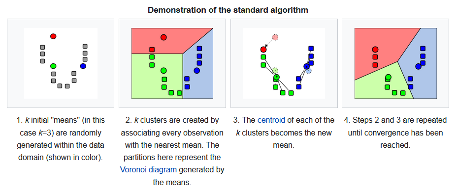
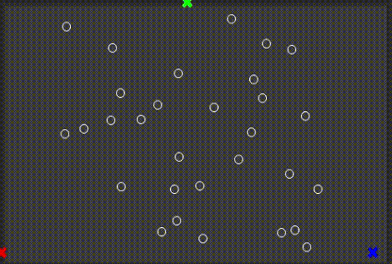

.. _sect-simulate:

**********
Simulation
**********

You've now seen how to write a function to handle time and create the frame in this specific time,
but the frame in each specific time has been specified by us.
What if we have a unpredictable model? Imaging that we have an algorithm,
and we would like to show people how it works.
The input of the algorithm could be different. And even if they are not different,
the results of the algorithm could also be different.

In this chapter, we will look at simulation, way to visualize your custom model.

Simulate with Your Own Data Type
================================

``simulate`` runs a simulation of given model in a window.
Let's take a look at the prototype at first.

.. code-block:: idris
   :caption: ``simulate``

   simulate 
        :  (window  : Display)
        -> (bgColor : Color)
        -> (tpf     : Double)
        -> (model   : a)
        -> (m2p     : (a -> Picture))
        -> (m2m     : (Double -> a -> a))
        -> IO ()

-  ``model``: the initial user-defined model, of some generic type ``a``.
-  ``m2p``: a function tells IdrisGL how to display a model.
-  ``m2m``: similar to ``picF`` in ``animate``, except that it uses the passed time to step the model.
   If the stepping of models doesn't depend on time. Your function can ignore the time IdrisGL passed.

Let's explore further with an example of using ``simulate``.

Dependent Model and An Example of K-Means Clustering
====================================================

`Example Code: K-Means
<https://github.com/ECburx/Idris2GL/tree/main/samples/simulation_kmeans/>`_

Let's take a look at the definition of K-Means Clustering:

*k-means clustering is a method of vector quantization, originally from signal processing,
that aims to partition n observations into k clusters in which each observation belongs to
the cluster with the nearest mean (cluster centers or cluster centroid), serving as a
prototype of the cluster.* [1]_

   Demonstration of the standard algorithm [1]_

Starting from defining our model, let's write model of some suitable dependent type.
In this case, our model would be a dataset along with *k* *means*.
We choose vector to store data (units),
because the total number of data (units) and that of *means* (center of clusters) are constant.

.. code-block:: idris
   :caption: Model of dependent type

   ||| A data unit in dataset.
   data UNIT = Ut Int Int Color

   ||| A dataset with n units and k sets.
   data DataSet : (k : Nat) -> Type where
      DS : (units : Vect n UNIT) -> (means : Vect k UNIT) -> DataSet k

And then initial model would be our data units which haven't belong to any set,
and three randomly generated *means* within the data domain.
We choose three colors : red, green and blue, with each color represents *mean* of one set.
Please note that we use functions in ``IdrisGL.Random`` to generate random number in range,
which is not recommended because of its limitations.

.. code-block:: idris
   :caption: Model of dependent type

   -- Initial dataset with k = 3.
   initDS : DataSet 3
   initDS = 
         -- Units in white haven't belong to any set.
      DS [Ut 358 276 white ... Ut 85 160 white]
         -- Initial means of three sets.
         [Ut (randomInt 0 maxData) (randomInt 0 maxData) red
         ,Ut (randomInt 0 maxData) (randomInt 0 maxData) green
         ,Ut (randomInt 0 maxData) (randomInt 0 maxData) blue]

Now, we have defined our model. The next thing to do is telling IdrisGL how to display our model:

.. code-block:: idris

   showDS : DataSet k -> Picture
   showDS ds = Pictures $ <pictures of means> ++ <picture of data units>

Finally, stepping our model, which is actually updating clusters.
*k* clusters are created by associating every observation with the nearest *mean*.
``belong`` updates the color of a data unit to the color of the nearest *mean*.
Once the color of one data unit changed, the data unit belongs to a new cluster.

.. code-block:: idris

   belong : (unit : UNIT) -> (means : Vect k UNIT) -> (d2 : Int) -> UNIT

The centroid of each of the *k* updated clusters becomes the new *mean*.
To update our *k* *means*, 
``xySum`` calculates the coordinate sum and quantity of the data belonging to a certain cluster,
and ``updateMean`` updates the position of one mean.

.. code-block:: idris

   xySum : (mean : UNIT) -> (units : Vect n UNIT) -> (Int, Int, Int)

   updateMean : (mean : UNIT) -> (units : Vect n UNIT) -> UNIT

The we have our ``updateDS`` to step our model (with ignoring the time IdrisGL passed):

.. code-block:: idris

   updateDS : Double -> DataSet k -> DataSet k
   updateDS _ (DS units means) =
      let newUnits = (\u => belong u means <distance^2>) <$> units
          newMeans = (\m => updateMean m newUnits) <$> means
      in  DS newUnits newMeans

Passes this function to ``simulate`` and see what IdrisGL simulated:

.. code-block:: idris
   
   main : IO ()
   main = simulate window bgColor 1 initDS showDS updateDS

Simulate a Model with Monad StateT
==================================

StateT is the monad transformer for the State monad.
It adds a layer of generality by allowing you to put an arbitrary monad inside the state.
``simulateStateT`` runs a simulation with mutable state in a window.

.. code-block:: idris
   :caption: ``simulateStateT``
   
   simulateStateT
      :  (window    : Display)
      -> (bgColor   : Color)
      -> (tpf       : Double)
      -> (stateType : a)
      -> (m2p       : StateT a IO Picture)
      -> (m2m       : Double -> StateT a IO ())
      -> IO ()

The different between ``simulateStateT`` and ``simulate`` is
the function ``m2p`` which converts a model to pictures,
and the function ``m2m`` which handles the time IdrisGL passed.
Here is pseudocode of two example uses.

.. code-block:: idris

   -- m2p function
   showModel : StateT <myModel> IO Picture
   showModel = do
      model <- get
      ...
      pure $ <pictures of this model>

   -- m2m function
   stepModel : (seconds : Double) -> StateT <myModel> IO ()
   stepModel seconds = do
      model <- get
      put $ update model

We will discuss further of working with mutable state in next chapter.

.. [1] https://en.wikipedia.org/wiki/K-means_clustering